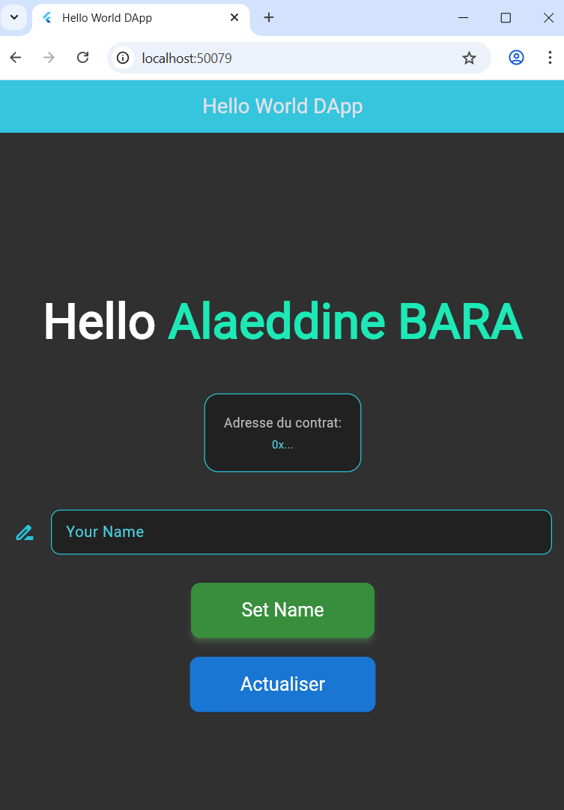

# HelloWorld DApp — Flutter + Solidity + Truffle 🧩

[](https://flutter.dev)
[](https://soliditylang.org)
[](https://trufflesuite.com)
[](https://pub.dev/packages/web3dart)
[](#)

A cross‑platform Flutter decentralized application (DApp) that connects to a local Ethereum network (Ganache) via `web3dart`, interacts with a simple `HelloWorld` smart contract deployed using Truffle, and provides a clean UI to read and update on‑chain state.


## 🚀 Project Overview
- **Purpose**: Demonstrate end‑to‑end DApp integration: Solidity contract → Truffle migration → Flutter UI using `web3dart`.
- **Main Objectives**:
  - Compile, deploy, and test a Solidity contract locally.
  - Link a Flutter app to the deployed contract and call functions.
  - Showcase a minimal yet production‑friendly architecture for web3 Flutter apps.
- **Key Features**:
  - Read and update the `yourName` value on chain.
  - Provider‑based state management and reactive UI.
  - Works on mobile, web, and desktop targets.
  - Uses Truffle’s `contracts_build_directory` to consume ABI + network info directly in Flutter.


## 🖼️ Visual Elements
- **Screenshot**:
  
  
  
- **Badges**: See header for tech stack and platform support.
- **Interactive Demo**: Build and run the Flutter web target with `flutter run -d chrome` (details below).


## 🔧 Installation Guide
- **Prerequisites**:
  - `Flutter` SDK 3.x and platform toolchains (Android/iOS/Web/Desktop)
  - `Node.js` and `npm`
  - `Truffle` (global): `npm install -g truffle`
  - `Ganache` (UI or CLI) running at `http://127.0.0.1:7545` with chainId `1337`

- **Clone and Setup**:
  1. Clone the repository.
  2. Start Ganache on `127.0.0.1:7545` (chainId `1337`).
  3. Navigate to the Truffle project directory: `cd TP8_`.
  4. Compile contracts: `truffle compile`.
  5. Migrate contracts: `truffle migrate --network development`.
  6. Ensure ABI artifacts exist at `TP8_/src/artifacts/*.json` and include the `networks.5777.address` entry.

- **Flutter Dependencies**:
  - From `TP8_/`, fetch packages: `flutter pub get`.

- **Configuration Options**:
  - RPC URL and private key are currently set inside `TP8_/lib/contract_linking.dart`.
    - Update `_rpcUrl` and `_privateKey` to match your Ganache setup.
    - Security: do not commit real keys; prefer passing secrets via `--dart-define` or using a secure secrets manager.
  - Contract address is read from the Truffle artifact (`HelloWorld.json → networks.5777.address`).


## ▶️ Usage Documentation
- **Run (mobile/desktop)**:
  - From `TP8_/`: `flutter run`
- **Run (web)**:
  - From `TP8_/`: `flutter run -d chrome`
- **Common Commands**:
  - Truffle compile: `truffle compile`
  - Truffle migrate: `truffle migrate --network development`
  - Truffle tests: `truffle test`

- **Common Use Cases**:
  - Read current name: App loads `yourName` and displays “Hello {name}”.
  - Set a new name: Enter text and tap “Set Name”; transaction is sent with chainId `1337`, then state refreshes.


## 🧭 Project Structure
```
BlockChain_TP/
├─ .vscode/
├─ DEMO.png
├─ README.md            ← this file
├─ Readme.md            ← previously empty root readme
└─ TP8_/
   ├─ contracts/        ← Solidity sources (HelloWorld.sol, Migrations.sol)
   ├─ migrations/       ← Truffle deployment scripts
   ├─ src/artifacts/    ← Truffle build output consumed by Flutter
   ├─ test/             ← Truffle tests (JS)
   ├─ lib/              ← Flutter app sources (UI + web3 linking)
   │  ├─ main.dart
   │  ├─ helloUI.dart
   │  └─ contract_linking.dart
   ├─ android/ ios/ macos/ linux/ windows/ web/  ← Flutter platform folders
   ├─ pubspec.yaml       ← Flutter dependencies and assets
   └─ truffle-config.js  ← Truffle network and compiler settings
```

- **Key Files**:
  - `TP8_/contracts/HelloWorld.sol`: Simple contract with `yourName` and `setName`.
  - `TP8_/lib/contract_linking.dart`: Web3 client setup, ABI loading, function calls.
  - `TP8_/src/artifacts/HelloWorld.json`: ABI + deployed network address (`5777`).
  - `TP8_/truffle-config.js`: Sets `contracts_build_directory` to `src/artifacts/` and compiler `0.8.21`.

- **Architecture Overview**:
  - Truffle handles contract compilation, migration, and testing.
  - ABI + network metadata are placed where Flutter can load them as assets.
  - Flutter uses `web3dart` with Provider to reactively call `yourName` and `setName`.


## 🤝 Contribution Guidelines
- **Report Issues**:
  - Use GitHub Issues with clear steps, expected vs actual, and environment details.
- **Pull Requests**:
  - Fork → feature branch → commit with clear messages → open PR with context and screenshots.
- **Development Setup**:
  - Keep Ganache running, migrate contracts after changes.
  - Run `flutter pub get` when `pubspec.yaml` updates.
  - Prefer not to commit secrets; use local overrides.


## 📜 License
- No license file currently present. Consider adding `LICENSE` (e.g., MIT) to clarify usage.


## 🙏 Acknowledgments
- Flutter, web3dart, Truffle, and Ganache teams for their tooling.


## 🛣️ Roadmap / Future Plans
- Replace hard‑coded secrets with `--dart-define` or secure storage.
- Display active contract address and account in the UI.
- Add Flutter widget tests and integration tests.
- Add CI badges (build, test coverage) via GitHub Actions.
- Package web build with a public demo.

---

💡 Tip: Keep this README updated when contracts, network configs, or UI flows change. Screenshots and badges help readers quickly grasp the project’s status.
